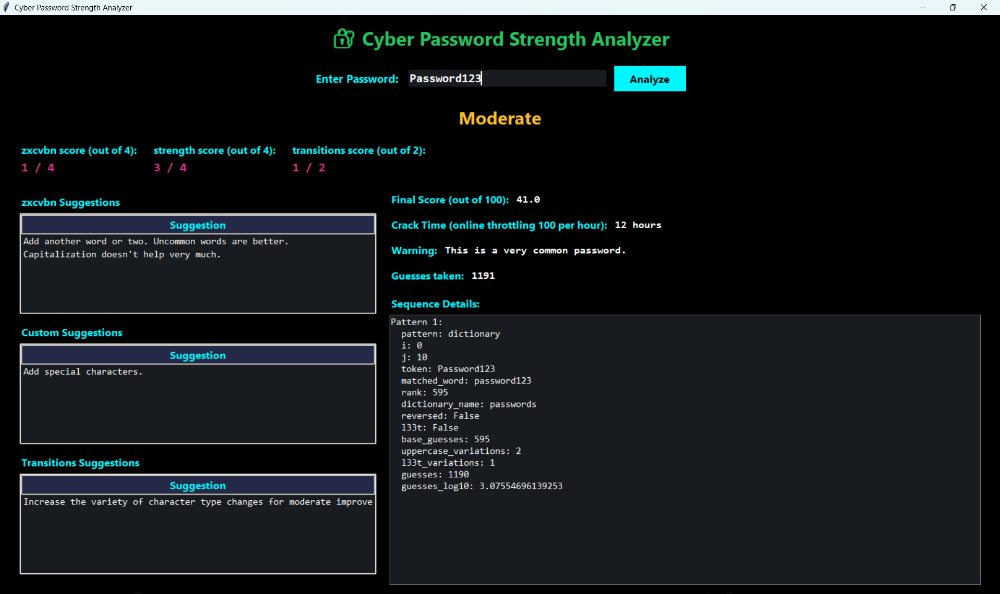

# Cyber Password Strength Analyzer

A modern, multi-metric password strength checker built in Python, featuring a cyber-inspired GUI and robust security analysis. Developed as part of my internship at Tamizhan Skills, this project demonstrates practical cybersecurity, real-time feedback, and user-focused interface design.

---

## Table of Contents

1. [General Info](#general-info)
2. [Project Status](#project-status)
3. [Screenshot](#screenshot)
4. [Architecture Diagram](#architecture-diagram)
5. [Technologies](#technologies)
6. [Requirements](#requirements)
7. [Installation & Usage](#installation--usage)
8. [Troubleshooting](#troubleshooting)
9. [Collaboration](#collaboration)
10. [Known Issues & Bug Fixes](#known-issues--bug-fixes)
11. [FAQs](#faqs)
12. [Recommendations for Improvement](#recommendations-for-improvement)
13. [Acknowledgements](#acknowledgements)

---

## General Info

This project is a cyber-themed password strength analyzer that evaluates passwords using multiple metrics: zxcvbn entropy score, custom character variety checks, and transitions between character types. The application provides instant, color-coded feedback, actionable suggestions, and detailed pattern analysis in a visually engaging GUI.

---

## Project Status

- **Status:** Completed (June 2025)

---

## Screenshot

---

## Architecture Diagram

   +---------------------+
   |     User Input      |
   |  (Password Entry)   |
   +----------+----------+
              |
              v
+-----------------------------+
|    Password Analyzer Core   |
|-----------------------------|
| - zxcvbn Entropy Analysis   |
| - Custom Heuristics         |
|   (length, char variety)    |
| - Transition Analysis       |
| - Pattern Detection         |
+-------------+---------------+
              |
              v
+-----------------------------+
|      Result Aggregator      |
|-----------------------------|
| - Final Weighted Score      |
| - Strength Label            |
| - Suggestions Generator     |
| - Crack Time Estimator      |
+-------------+---------------+
              |
              v
+-----------------------------+
|           GUI               |
|-----------------------------|
| - Color-coded Feedback      |
| - Suggestions Display       |
| - Sequence Details          |
| - User Guidance             |
+-----------------------------+

*Password is analyzed using multiple metrics; results and suggestions are shown instantly in the GUI.*

---

## Technologies

- [Python 3](https://www.python.org/)
- [Tkinter](https://docs.python.org/3/library/tkinter.html) (GUI)
- [zxcvbn-python](https://github.com/dwolfhub/zxcvbn-python) (Password entropy analysis)
- [Regular Expressions](https://docs.python.org/3/library/re.html) (Pattern checks)

---

## Requirements

- Python 3.8 or newer
- [zxcvbn-python](https://pypi.org/project/zxcvbn/)
- No additional dependencies for GUI (Tkinter is included with Python)

Install dependencies with:

pip install -r requirements.txt

---

## Installation & Usage

Clone the repository and run the application as follows:

git clone https://github.com/Achuzzxd/Cyber_Security_and_Ethical_Hacking.git
cd Cyber_Security_and_Ethical_Hacking/Password\ Strength\ Checker
pip install -r requirements.txt
python main.py

**Usage:**
1. Enter your password in the input field.
2. Click "Analyze" to view the strength score, feedback, and suggestions.
3. Use the actionable tips to improve your password security.

---

## Troubleshooting

- **zxcvbn not found:**  
  Run `pip install zxcvbn` to install the required library.
- **GUI does not launch:**  
  Ensure you are running Python 3 and Tkinter is available (included by default).
- **No feedback displayed:**  
  Check for errors in the terminal and ensure all dependencies are installed.

---

## Collaboration

Contributions, suggestions, and bug reports are welcome!

- Fork the repository and submit a pull request for new features or fixes.
- Please follow [PEP8](https://www.python.org/dev/peps/pep-0008/) style guidelines.
- For major changes, open an issue first to discuss your ideas.
- All contributions should be well-documented and tested.

> "Building secure software is a team effort. Your ideas and improvements are valued!"

---

## Known Issues & Bug Fixes

- Some advanced password patterns may not be fully recognized by zxcvbn.
- GUI may not scale perfectly on ultra-high-DPI screens (planned improvements).
- Final score weights may need further tuning for edge cases.

---

## FAQs

1. **How is password strength calculated?**  
   - Combines zxcvbn entropy score, custom character variety checks, and transitions between character types for a comprehensive score.

2. **What do the color-coded labels mean?**  
   - *Very Strong*, *Strong*, *Moderate*, and *Weak* indicate the overall security level of your password.

3. **Does this app store my passwords?**  
   - No. All analysis is done locally and no passwords are stored or transmitted.

4. **Can I use this on any OS?**  
   - Yes, as long as Python 3 and Tkinter are available (Windows, macOS, Linux).

---

## Recommendations for Improvement

### High Priority

- **Add password history analysis:**  
  Allow users to compare past passwords for better security habits.

- **Customizable scoring weights:**  
  Let users adjust how much each metric impacts the final score.

- **Accessibility improvements:**  
  Enhance keyboard navigation and screen reader support.

### Medium Priority

- **Exportable reports:**  
  Enable users to save or print password analysis results.

- **Internationalization:**  
  Support multiple languages in the interface.

- **Mobile-friendly version:**  
  Adapt the GUI for smaller screens.

### Low Priority

- **Dark/light mode toggle:**  
  Allow users to switch themes.

- **Plugin system:**  
  Let users add their own password analysis modules.

*Suggestions and contributions for these improvements are welcome! Please open an issue or submit a pull request if you'd like to help.*

---

## Acknowledgements

Special thanks to the Tamizhan Skills team for their mentorship and support during my internship.

---

#Cybersecurity #Python #PasswordSecurity #GUI #Internship #TamizhanSkills #UserExperience #OpenSource
