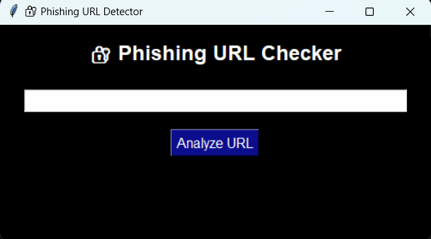
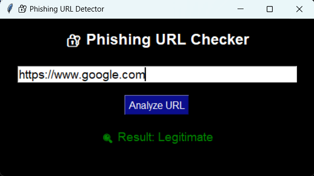
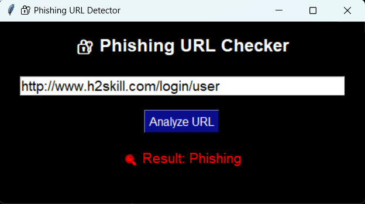

# 🛡️ Phishing URL Detector

A robust **machine learning-based phishing URL detection application** with an intuitive GUI built in Python. Developed as part of my cybersecurity learning projects, this tool demonstrates practical ML deployment for real-world security challenges.

---

## Table of Contents

1. [General Info](#general-info)
2. [Project Status](#project-status)
3. [Screenshot](#screenshot)
4. [Architecture Diagram](#architecture-diagram)
5. [Technologies](#technologies)
6. [Requirements](#requirements)
7. [Installation & Usage](#installation--usage)
8. [Troubleshooting](#troubleshooting)
9. [Collaboration](#collaboration)
10. [Known Issues & Bug Fixes](#known-issues--bug-fixes)
11. [FAQs](#faqs)
12. [Recommendations for Improvement](#recommendations-for-improvement)
13. [Acknowledgements](#acknowledgements)

---

## General Info

This project is a **phishing detection system** that uses machine learning models trained on URL features to classify whether a given URL is legitimate or phishing. It includes:

- A **Python-based feature extraction module** to process URLs.
- A **pre-trained ML model** for prediction.
- A **Tkinter-based GUI** for user-friendly interaction.

The application helps users identify potentially malicious URLs instantly and demonstrates practical ML integration in cybersecurity.

---

## Project Status

**Status:** Completed (June 2025)

---

## Screenshot

  

---

## Architecture Diagram
undefined
+------------------+
| User Input |
+------------------+
|
v
+-------------------------+
| Tkinter GUI Layer | <-- User enters URL, triggers analysis
+-------------------------+
|
v
+-------------------------+
| Feature Extraction | <-- Extracts lexical, domain, and technical features
+-------------------------+
|
v
+-------------------------+
| Pre-trained ML Model | <-- Classifies as "Legitimate" or "Phishing"
+-------------------------+
|
v
+-------------------------+
| Result Display (GUI) | <-- Shows result and confidence score
+-------------------------+
undefined

The GUI takes user input, extracts features from the URL, feeds them into the ML model, and displays whether it is **Legitimate** or **Phishing**.

---

## Technologies

- **Python 3**
- **Tkinter** (GUI)
- **Scikit-learn** (Machine Learning)
- **Pandas** (Data Handling)
- **Joblib** (Model Serialization)
- **Regex (`re`)** (Feature extraction)

---

## Requirements

- **Python 3.8 or newer**
- **Scikit-learn**
- **Pandas**
- **Joblib**

Install dependencies with:

pip install -r requirements.txt

---

## Installation & Usage

Clone the repository and run the application as follows:

git clone https://github.com/Achuzzxd/Cyber_Security_and_Ethical_Hacking.git
cd Cyber_Security_and_Ethical_Hacking/Phishing\ URL\ detector
pip install -r requirements.txt
python src/gui.py

### Usage

- Enter the URL you want to check in the input field.
- Click "**🧠 Analyze URL**" or press Enter.
- The result will display whether the URL is **Legitimate** (green) or **Phishing** (red).

---

## Troubleshooting

- **Model not found:**  
  Ensure that `phishing_detector_model.pkl` exists in the specified `models/` directory.
- **Module not found error:**  
  Run `pip install -r requirements.txt` to install missing dependencies.
- **GUI does not open:**  
  Confirm that Tkinter is installed and you are using Python 3.

---

## Collaboration

**Contributions are welcome!** You can:

- Fork the repository and submit pull requests for enhancements.
- Report issues with detailed reproduction steps.
- Suggest additional features or improvements.

> "Learning together makes cybersecurity stronger for everyone."

---

## Known Issues & Bug Fixes

- Currently supports **single URL input** at a time.
- **No backend database** for storing prediction logs.
- **Model performance** depends on training data; real-time URL threat analysis is not implemented yet.

---

## FAQs

**What does this app do?**  
It checks if a given URL is phishing or legitimate using a trained ML model.

**How does it detect phishing?**  
It extracts numerical features from the URL and uses a supervised machine learning model to classify it.

**Can I use it on any platform?**  
Yes. It works on any OS with Python 3 and Tkinter installed.

**How can I train my own model?**  
You can modify the `feature_extraction.py` and use scikit-learn to train with your own dataset.

**Is it 100% accurate?**  
No ML model is perfect. It predicts based on patterns in training data; real-time analysis and threat feeds are required for production use.

---

## Recommendations for Improvement

### High Priority

- **Integrate real-time threat intelligence feeds** to check URLs against blacklists.
- **Enhance feature engineering** with WHOIS data, SSL certificate checks, and URL shortening detection.
- **Deploy as a web application** for easy user access.

### Medium Priority

- **Train with larger, up-to-date datasets** for better accuracy.
- **Add batch URL scanning** to check multiple URLs at once.
- **Implement result logging** to track past predictions.

### Low Priority

- **Improve GUI aesthetics** with modern frameworks like PyQt or web-based UI.
- **Add notification alerts** for phishing detection.
- **Create installer executables** for Windows and Mac.

---

## Acknowledgements

Thanks to **cybersecurity open datasets**, **Scikit-learn documentation**, and **Tamizhan Skills** for their support in my cybersecurity learning journey.

---

*#Cybersecurity #MachineLearning #Python #PhishingDetection #Internship #TamizhanSkills #GUI #SoftwareDevelopment #SecurityTools*
