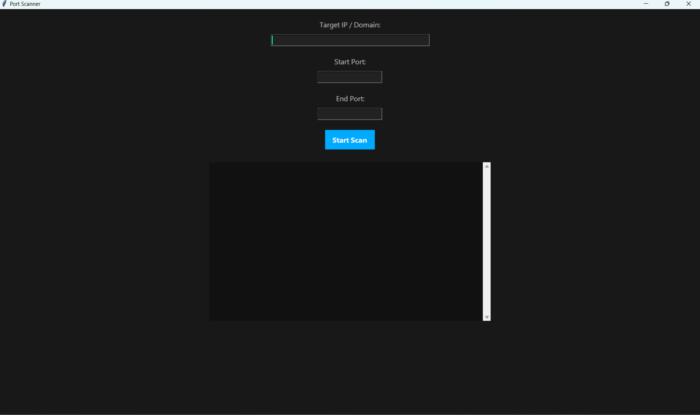
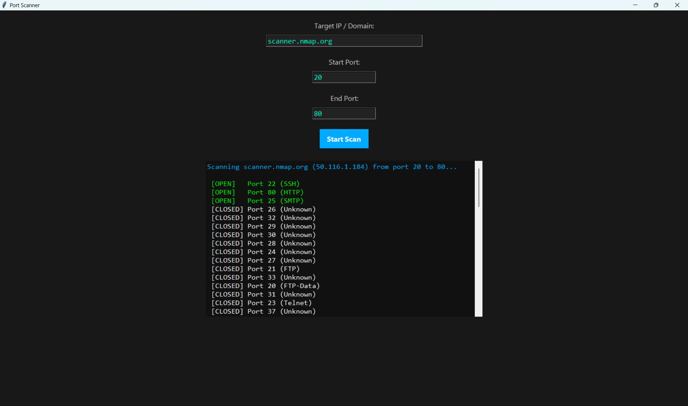

# GUI-Based Port Scanner Using Python

A fast, multithreaded **Port Scanner Tool** with a modern, full-view GUI built in Python using Tkinter, socket programming, and threading. Developed during a **Cybersecurity Internship at Tamizhan Skills**, this tool demonstrates how to identify open and closed ports on a given IP address or domain, assess network surface area, and visualize port states in real-time with color-coded results.

> "Cybersecurity begins at the ports. If a port is left open unknowingly, it can become a door for attackers."

---

## Table of Contents

1. [General Info](#general-info)
2. [Project Status](#project-status)
3. [Screenshot](#screenshot)
4. [Architecture Diagram](#architecture-diagram)
5. [Technologies](#technologies)
6. [Requirements](#requirements)
7. [Installation & Usage](#installation--usage)
8. [Usage Instructions](#usage-instructions)
9. [Troubleshooting](#troubleshooting)
10. [Collaboration](#collaboration)
11. [Known Issues & Bug Fixes](#known-issues--bug-fixes)
12. [FAQs](#faqs)
13. [Recommendations for Improvement](#recommendations-for-improvement)
14. [Acknowledgements](#acknowledgements)

---

## General Info

This GUI-based port scanner allows users to scan a target (domain or IP) for open and closed TCP ports within a given range. Built with multi-threading, it efficiently displays the status of each port and associated common service names like HTTP, FTP, SSH, etc. The latest version features a **sleek dark UI**, **color-coded results** (open ports in green, closed ports in white), and **full-screen support**. Navigation is streamlined: use Enter to move between fields and to start the scan. Intended for educational use and to demonstrate core concepts of ethical hacking and network security.

---

## Project Status

* **Status:** Completed (July 2025)

* **Organization:** Tamizhan Skills
---

## Screenshot

### Port Scanner GUI Screenshot:



### Port Scanner working Screenshot:


---

## Architecture Diagram

```
+----------------------------+
| User Inputs Target & Ports |
+------------+--------------+
             |
             v 
+-------------------------------+
|  Threaded Port Scanner (TCP)  |
|   - Uses socket connections   |
|   - Checks open/closed state  |
+---------------+---------------+
                |
                v
+-------------------------------+
|      GUI Displays Results     |
|     - Open ports in green     |
|    - Closed ports in white    |
| - Common service names shown  |
+-------------------------------+
```

---

## Technologies

* Python 3
* Tkinter (for GUI)
* Socket (for network scanning)
* Threading (for concurrency)
* ScrolledText (for live output box)

---

## Requirements

python>=3.7
tk


If you're on Linux:
```
sudo apt-get install python3-tk
```

---

## Installation & Usage

### 1. Clone the Repository

```bash
git clone https://github.com/Achuzzxd/Cyber_Security_and_Ethical_Hacking.git
```
```bash
cd Cyber_Security_and_Ethical_Hacking/Port\ Scanner
```

### 2. (Optional) Create Virtual Environment

```bash
python -m venv venv
```

```bash
source venv/bin/activate  
```

# On Windows:

```bash
venv\Scripts\activate
```

### 3. Install Requirements

```bash
pip install -r requirements.txt
```

### 4. Run the Application

```bash
python gui.py
```

---

## Usage Instructions

- **Target IP / Domain:** Enter a valid IP address or domain name to scan.
- **Start Port:** Enter the starting port number (0–65535).
- **End Port:** Enter the ending port number (0–65535, must be >= Start Port).
- **Navigation:** Press Enter to move between fields. Press Enter in the last field or click "Start Scan" to begin.
- **Results:** Open ports are shown in green, closed ports in white, on a black background. The GUI maximizes to full view on launch.

---

## Troubleshooting

* **Ports not scanning?**
  * Ensure the IP/domain is reachable.
* **GUI not opening?**
  * Make sure Tkinter is installed (`python -m tkinter` to test).
* **Slow scanning?**
  * Use threading; adjust port range for better speed.
* **Output not colored?**
  * Make sure you are running the latest `gui.py` with color-coded output.

---

## Collaboration

* Fork the repository and submit pull requests
* Adhere to [PEP8](https://peps.python.org/pep-0008/) standards
* Open issues for bugs or feature requests

> "Even the simplest tool, when made collaborative, becomes powerful."

---

## Known Issues & Bug Fixes

* No scan cancellation once started (planned feature)
* Might flag closed ports as filtered if host blocks them silently

---

## FAQs

1. **What ports can I scan?**  
   You can scan any TCP ports within the range of 0–65535.

2. **Does this scan UDP ports?**  
   No. Currently only supports TCP port scanning.

3. **Can I scan websites?**  
   Yes. Enter a domain like `google.com` — it will be resolved to IP.

4. **Is this legal?**  
   Only scan systems you own or have permission to scan.

---

## Recommendations for Improvement

### High Priority:

* Add scan cancel button
* Visual scan progress bar
* CSV export of scan results

### Medium Priority:

* Add support for UDP scanning
* Multi-target scan (scan multiple IPs)

### Low Priority:

* Add light/dark mode switcher
* Localization for multi-language support

---

> "Ethical hacking starts with curiosity, and tools like these turn that curiosity into capability."

**_Enjoy scanning with style and speed!_**

