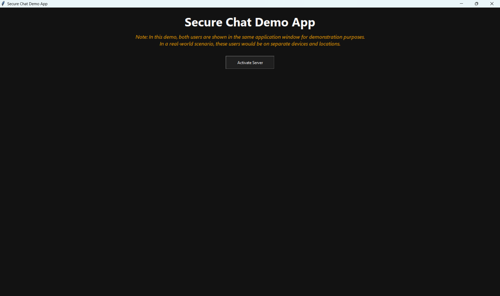
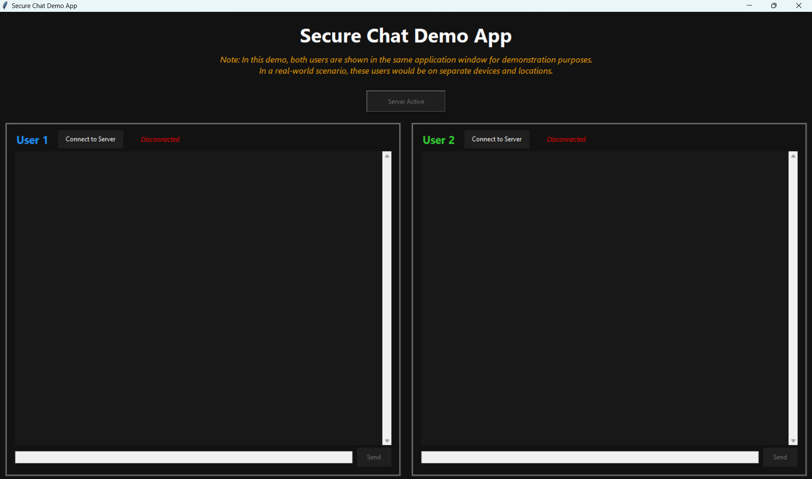
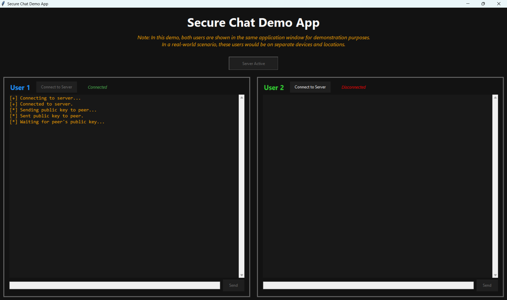
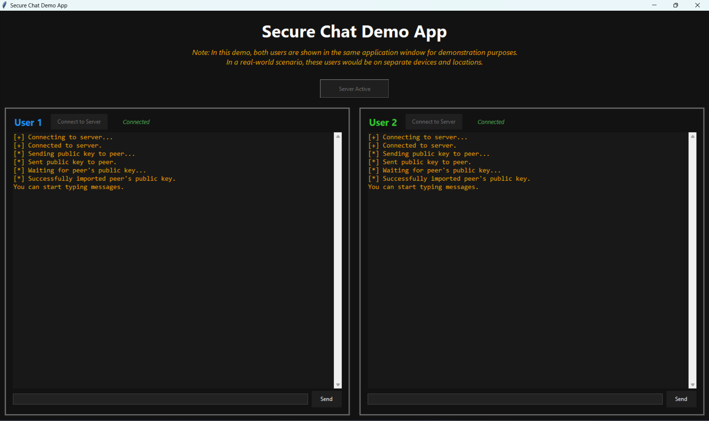
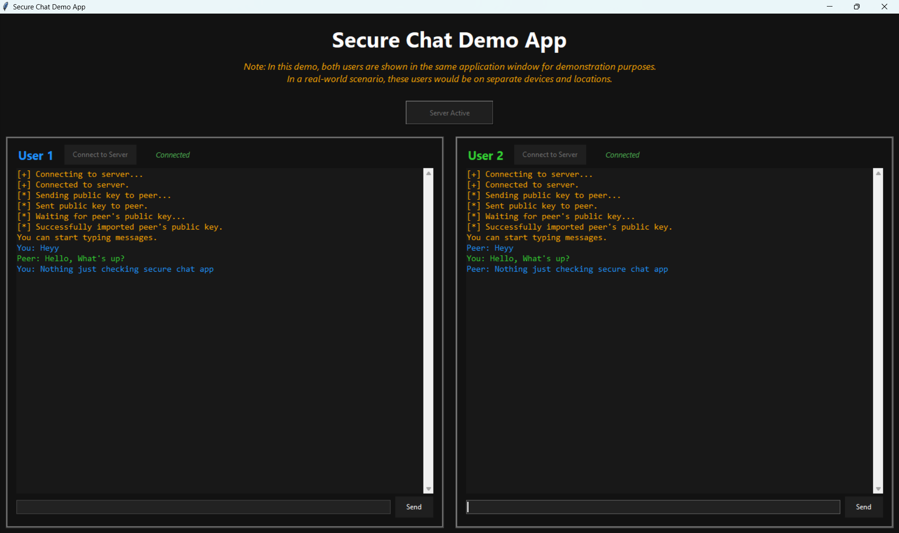

# Secure Peer-to-Peer Encrypted Chat Application

A modern, end-to-end encrypted chat application built in Python, featuring a sleek GUI and robust cryptographic security. Developed as part of my internship at Tamizhan Skills, this project demonstrates secure communication, practical cryptography, and user-centric interface design.

---

## Table of Contents

1. [General Info](#general-info)
2. [Project Status](#project-status)
3. [Screenshot](#screenshot)
4. [Architecture Diagram](#architecture-diagram)
5. [Technologies](#technologies)
6. [Requirements](#requirements)
7. [Installation & Usage](#installation--usage)
8. [Troubleshooting](#troubleshooting)
9. [Collaboration](#collaboration)
10. [Known Issues & Bug Fixes](#known-issues--bug-fixes)
11. [FAQs](#faqs)
12. [Recommendations for Improvement](#recommendations-for-improvement)
13. [Acknowledgements](#acknowledgements)

---

## General Info

This project is a secure chat system that allows two users to communicate privately using RSA encryption. The system consists of a Python-based server that relays encrypted messages and two GUI clients that handle key exchange, encryption, and decryption. The user interface is designed for clarity and ease of use, making secure communication accessible and intuitive.

---

## Project Status

- **Status:** Completed (July 2025)

---

## Screenshot

---

## Architecture Diagram

+---------+ Encrypted +---------+ Encrypted +---------+
| User 1 | <----------------------> | Server | <----------------------> | User 2 |
+---------+ (RSA Key Exchange) +---------+ (RSA Key Exchange) +---------+

*Messages are encrypted end-to-end using RSA. The server only relays encrypted data and does not have access to plaintext messages.*

---

## Technologies

* [Python 3](https://www.python.org/)
* [Tkinter](https://docs.python.org/3/library/tkinter.html) (GUI)
* [PyCryptodome](https://www.pycryptodome.org/) (RSA encryption)
* [Socket Programming](https://docs.python.org/3/library/socket.html)
* [Threading](https://docs.python.org/3/library/threading.html)

---

## Requirements

- Python 3.8 or newer
- [PyCryptodome](https://pypi.org/project/pycryptodome/)

Install dependencies with:

pip install -r requirements.txt

---

## Installation & Usage

Clone the repository and run the application as follows:

git clone https://github.com/Achuzzxd/Cyber_Security_and_Ethical_Hacking.git
cd Cyber_Security_and_Ethical_Hacking/Secure\ Chat\ App
pip install -r requirements.txt
python gui.py

**Usage:**
1. Click "Activate Server" to start the chat server.
2. Click "Connect to Server" for User 1 and User 2 individually.
3. Once both users have exchanged keys, chat securely in real time.

*Note: Both users are shown in the same window for demonstration. In real-world use, each user would run their own client on separate devices.*

---

## Troubleshooting

- **Cannot connect to server:**  
  Ensure the server is activated before connecting clients. Check firewall and port settings.
- **PyCryptodome not found:**  
  Run `pip install pycryptodome` to install the required cryptography library.
- **GUI freezes:**  
  Make sure you are running Python 3 and all dependencies are installed. If issues persist, restart the application.

---

## Collaboration

We welcome contributions, suggestions, and bug reports!

- Fork the repository and submit a pull request for new features or bug fixes.
- Please follow [PEP8](https://www.python.org/dev/peps/pep-0008/) style guidelines.
- For major changes, open an issue first to discuss your ideas.
- All contributions should be well-documented and tested.

> "Collaboration is the key to secure and innovative software. Let's build a safer digital world together."

---

## Known Issues & Bug Fixes

- Only two users can chat at a time (current limitation).
- No message history after closing the app.
- Occasional connection drops if the server is closed abruptly.
- GUI may freeze if network errors are not handled gracefully (improvements planned).

---

## FAQs

1. **Can I use this app for group chats?**  
   _Not yet. The current version supports only two users per session. Group chat is planned for future releases._

2. **How secure is the chat?**  
   - Uses RSA encryption for all messages.
   - Key exchange is performed securely at the start of each session.
   - Only the intended recipient can decrypt messages.

3. **Does this work over the internet?**  
   - Yes, if you configure port forwarding and firewall rules on your server machine.

4. **How can I contribute or report bugs?**  
   - Fork the repo, make your changes, and submit a pull request.
   - For bugs, open an issue with detailed steps to reproduce.

5. **What platforms are supported?**  
   - Any platform with Python 3 and Tkinter (Windows, macOS, Linux).

---

## Recommendations for Improvement

Below are some suggested enhancements and future directions for the Secure Chat App:

### High Priority

- **Add Group Chat Support:**  
  Enable multiple users to participate in a single chat session, expanding beyond one-to-one communication.

- **Persistent Chat History:**  
  Store encrypted chat logs locally or in a secure database so users can access previous conversations after restarting the app.

- **Enhanced Error Handling:**  
  Improve detection and reporting of network errors, disconnections, and failed key exchanges for a smoother user experience.

- **User Authentication:**  
  Implement user registration and login features to verify participants and prevent unauthorized access.

- **Improved UI/UX:**  
  Refine the graphical interface for better usability, responsiveness, and accessibility.

### Medium Priority

- **Security Deep-Dive Documentation:**  
  Provide detailed explanations of the cryptographic protocols, key management, and potential vulnerabilities.

- **Code Structure Overview:**  
  Add a section in the README describing the main modules and their responsibilities for easier onboarding of new contributors.

- **Performance and Scalability:**  
  Optimize the server to handle more concurrent users and document network requirements and limitations.

- **Testing and Development Setup:**  
  Include automated tests, sample data, and instructions for running the app in development mode.

### Low Priority

- **Cross-Platform Packaging:**  
  Offer easy-to-install executables for Windows, macOS, and Linux.

- **Internationalization:**  
  Add support for multiple languages in the user interface.

- **Notification System:**  
  Implement desktop or in-app notifications for incoming messages or connection events.

---

*Contributions and suggestions for these improvements are welcome! If you have ideas or want to help implement any of these features, please open an issue or submit a pull request.*

---

## Acknowledgements

Special thanks to the Tamizhan Skills team for their mentorship and support during my internship.

---

#Cybersecurity #Python #Encryption #Networking #Internship #TamizhanSkills #SecureCommunication #SoftwareDevelopment
