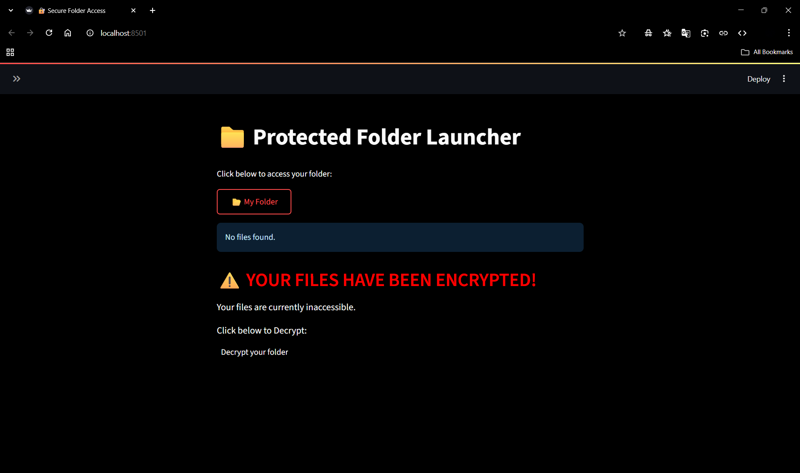
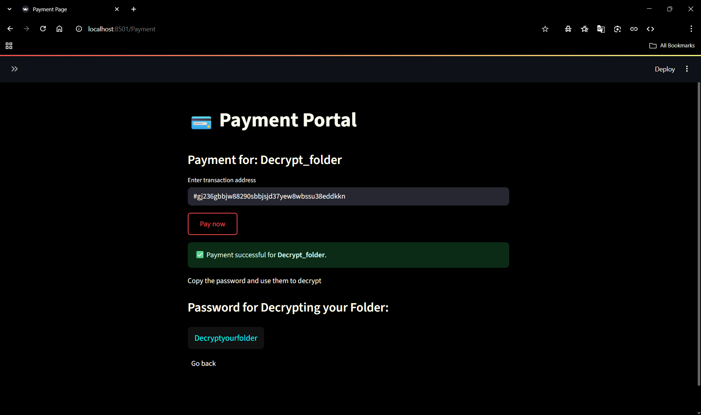

# 🔒 Simple Ransomware Simulator

A realistic educational ransomware simulator built using **Python** and **Streamlit**. Developed as part of my cybersecurity learning projects, this tool demonstrates ransomware behavior in a safe environment for understanding encryption, decryption, GUI design, and user interaction in cybersecurity training.

---

## Table of Contents

- [General Info](#general-info)
- [Project Status](#project-status)
- [Screenshot](#screenshot)
- [Architecture Diagram](#architecture-diagram)
- [Technologies](#technologies)
- [Requirements](#requirements)
- [Installation & Usage](#installation--usage)
- [Troubleshooting](#troubleshooting)
- [Collaboration](#collaboration)
- [Known Issues & Bug Fixes](#known-issues--bug-fixes)
- [FAQs](#faqs)
- [Recommendations for Improvement](#recommendations-for-improvement)
- [Acknowledgements](#acknowledgements)

---

## General Info

This **Simple Ransomware Simulator** encrypts user files using **AES encryption**, displays a ransom note with a payment portal simulation, and provides a decryption option upon entering the correct password.  
It is designed solely for educational purposes to demonstrate the working of ransomware in a controlled environment.

> **🔴 Disclaimer:** This project is strictly for educational and ethical demonstration. Do not misuse the code for malicious purposes.

---

## Project Status

**Status:** Completed (June 2025)

---

## Screenshot







---

## Architecture Diagram
```
+---------------------------+
|         User              |
+---------------------------+
            |
            v
+---------------------------+
|    Streamlit GUI Layer    |
+---------------------------+
            |
            v
+---------------------------+
|     Folder Selection      |
+---------------------------+
            |
            v
+---------------------------+
|   Background Encryption   |
|   (Encrypt Target Files,  |
|    Move to Dest Folder)   |
+---------------------------+
            |
            v
+---------------------------+
|  Ransom Note/Payment Page |
+---------------------------+
            |
            v
+---------------------------+
|   Decrypt Folder Page     |
|   (Password Entry)        |
+---------------------------+
            |
            v
+---------------------------+
|  Decrypt Folder Contents  |
|  (Move to view Folder,    |
|   Only folder decrypted,  |
|   files remain encrypted) |
+---------------------------+
              |
              v
    +---------------------------+
  __| "Can you see original     |
 |  |  data?" Prompt            |
 |  +---------------------------+
 |           |             |
 |           No            Yes
 |           |             |
 |           v             v
 |   +-----------------+   +--------------------------+
 |  | Decrypt Files   |   | Data Loss (Files remain  |
 |  | (Password Entry |   | encrypted or deleted)    |
 |__| after Payment)  |   +--------------------------+
    | (Show Original  |
    | Data)           |
    +-----------------+
```

    **Flow:**  

- User initiates the simulation via the Streamlit GUI by selecting a target folder for encryption.
- The simulator encrypts all files in the selected folder in the background using AES, moving encrypted files to a designated destination.
- The GUI transitions through simulation stages: home/dashboard, ransom note/payment portal, and decryption interface.
- After simulated payment, the **user enters a password to attempt decryption**:
    - Only the folder structure is initially decrypted; files remain encrypted.
    - The user is prompted: *"Can you see the original data?"*
        - If **No**: The simulator allows a second decryption step (with password), restoring files and enabling access to original data.
        - If **Yes**: The simulator simulates data loss—files remain encrypted or are deleted, and original data cannot be viewed.
- All encryption, decryption, and user actions are logged for educational review and iterative learning.
- The environment can be reset for repeated, risk-free simulations, ensuring no permanent data loss and supporting continuous training and improvement.

---

## Technologies

- **Python 3**
- **Streamlit** (GUI)
- **cryptography** (AES encryption)
- **subprocess, os, shutil** (file operations)
- **platform** (OS detection)

---

## Requirements

- **Python 3.8 or newer**
- **streamlit**
- **cryptography**

Install all dependencies with:

pip install -r requirements.txt


---

## Installation & Usage

Clone the repository and run the simulator as follows:

git clone https://github.com/Achuzzxd/Cyber_Security_and_Ethical_Hacking.git
cd Cyber_Security_and_Ethical_Hacking/Simple\ Ransomware\ Simulator
pip install -r requirements.txt
streamlit run Home.py


### Usage

- Launch the app to see your files are not listed.
- View the ransom note.
- Click to decrypt folder.
- Pay in the payment portal. 
- Enter the correct password to decrypt your folder.
- Decrypt your files seperately.
- Pay in the payment portal. 
- Enter the correct password to decrypt your file.
- View your data.
- Click yes if you can see your original data.
- Your Files will be gone permanently.


---

## Troubleshooting

- **Encryption not triggered:**  
  Ensure `encrypt.py` exists and is correctly referenced in subprocess calls.
- **Decryption fails despite correct password:**  
  Confirm your encryption key, salt, and password logic are consistent.
- **GUI not loading:**  
  Ensure Streamlit is installed and run using `streamlit run app.py`.
- **Permission errors:**  
  Run with appropriate privileges to read/write target directories.
- **Key or salt file missing:**  
  Check that `key_salt.bin` is generated during encryption.

---

## Collaboration

**Contributions, suggestions, and improvements are welcome!**

- Fork the repository and submit a pull request for new features, bug fixes, or enhancements.
- Follow PEP8 style guidelines for code consistency.
- For major changes, open an issue first to discuss proposed ideas.

> "Ethical understanding of malware and ransomware is essential to defend systems effectively."

---

## Known Issues & Bug Fixes

- Only supports files within specified folders.
- Session state may reset if Streamlit reloads unexpectedly.
- GUI styling is minimal; future UI/UX improvements planned.
- No real payment gateway integration (for ethical simulation only).
- Password is hardcoded for simulation; in production, integrate a secure authentication system.

---

## FAQs

**Is this a real ransomware?**  
No. It is a simulator for educational demonstration.

**Can this harm my computer?**  
No, it encrypts only demo files within designated folders.

**Can I integrate real payment systems?**  
This is discouraged and unethical. It is for educational use only.

**Does it support multiple OS platforms?**  
Yes, tested on Windows and Linux for file encryption.

**Can I extend this for penetration testing labs?**  
Yes, but ensure ethical usage within your learning environment.

---

## Recommendations for Improvement

### High Priority

- **Improve GUI Styling:** Enhance Streamlit pages for professional UX.
- **Dynamic File Targets:** Allow users to select encryption targets dynamically.
- **Logging Module:** Add encryption and decryption logging for analysis.

### Medium Priority

- **Key Management:** Implement safer key storage mechanisms for demonstration.
- **Progress Bars:** Show encryption/decryption progress for user clarity.

### Low Priority

- **Cross-Platform Packaging:** Package as a standalone educational executable.
- **Dark Mode Theme Customization:** More interactive visual options.

*Contributions to implement these recommendations are welcome.*

---

## Acknowledgements

Special thanks to **Tamizhan Skills** for mentorship and guidance in real-world cybersecurity practices and educational project development.

---

*#Cybersecurity #Python #Ransomware #Encryption #Streamlit #Internship #TamizhanSkills #MalwareAnalysis #EthicalHacking #ProjectShowcase*
