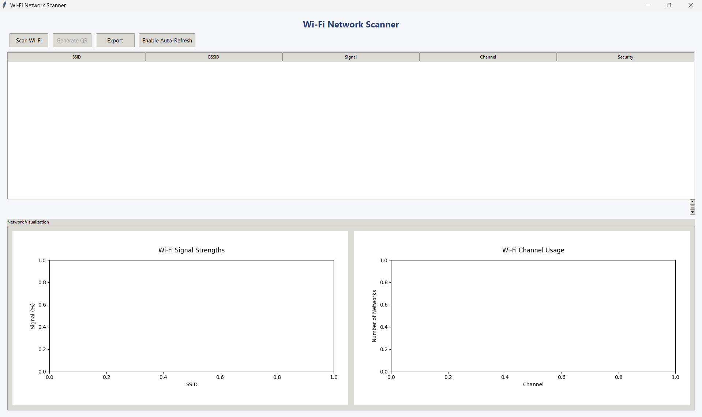

# Wi-Fi Network Scanner with Real-Time Visualization

A modern, cross-platform Wi-Fi network scanner built in Python, featuring a sleek GUI, real-time visualization, and robust export capabilities. Developed as part of my internship at Tamizhan Skills, this project demonstrates wireless scanning, data visualization, and user-centric interface design.

---

## Table of Contents

1. [General Info](#general-info)
2. [Project Status](#project-status)
3. [Screenshot](#screenshot)
4. [Architecture Diagram](#architecture-diagram)
5. [Technologies](#technologies)
6. [Requirements](#requirements)
7. [Installation & Usage](#installation--usage)
8. [Troubleshooting](#troubleshooting)
9. [Collaboration](#collaboration)
10. [Known Issues & Bug Fixes](#known-issues--bug-fixes)
11. [FAQs](#faqs)
12. [Recommendations for Improvement](#recommendations-for-improvement)
13. [Acknowledgements](#acknowledgements)

---

## General Info

This project is a Wi-Fi network scanner that allows users to discover, analyze, and visualize nearby wireless networks with a user-friendly Python GUI. The application scans for available Wi-Fi networks, displays essential details (SSID, BSSID, signal, channel, security), and provides real-time graphs for signal strength and channel usage. Security status is color-coded for quick assessment, and users can export results or generate Wi-Fi QR codes for easy sharing.

---

## Project Status

- **Status:** Completed (July 2025)

---

## Screenshot

Wi-Fi Network Scanner GUI Screenshot



Signal strength and Channel usage of Scanned Wi-Fi Networks


Generated QR Code Screenshot


Exported PDF File


---

## Architecture Diagram

```
+┌─────────────────────┐
│     User (GUI)      │
│   Tkinter Frontend  │
└─────────┬───────────┘
          │
          ▼
┌─────────────────────┐
│    GUI Components   │
│ - Network Table     │
│ - Signal Graph      │
│ - Channel Graph     │
│ - QR Code Generator │
└─────────┬───────────┘
          │
          ▼
┌─────────────────────┐
│   Scanner Module    │
│ - OS Detection      │
│ - Windows Scanner   │
│ - Linux Scanner     │
│ - Output Parsing    │
└─────────┬───────────┘
          │
          ▼
┌─────────────────────┐
│   OS System Calls   │
│  (netsh, iwlist)    │
└─────────┬───────────┘
          │
          ▼
┌─────────────────────┐
│   Wi-Fi Adapter     │
│  (Hardware Layer)   │
└─────────────────────┘

          ▲
          │
┌─────────┴───────────┐
│ Data Visualization  │
│   (matplotlib)      │
└─────────┬───────────┘
          │
          ▼
┌─────────────────────┐
│    Export Module    │
│ (CSV, PDF, QR Code) │
└─────────────────────┘
```


*The application uses OS-native commands to scan for Wi-Fi networks, parses the results, and displays them in a modern GUI with real-time updates and export options.*

---

## Technologies

- Python 3
- Tkinter (GUI)
- ttk (themed widgets)
- matplotlib (real-time graphs)
- qrcode and Pillow (QR code generation and image handling)
- fpdf (PDF export)
- csv (data export)
- subprocess and os (Wi-Fi scanning and system integration)
- platform (OS detection)
- collections.Counter (channel usage analysis)

---

## Requirements

- Python 3.8 or newer
- [matplotlib](https://pypi.org/project/matplotlib/)
- [qrcode](https://pypi.org/project/qrcode/)
- [Pillow](https://pypi.org/project/Pillow/)
- [fpdf](https://pypi.org/project/fpdf/)

Install all dependencies with:

pip install -r requirements.txt

---

## Installation & Usage

Clone the repository and run the application as follows:

git clone https://github.com/Achuzzxd/Cyber_Security_and_Ethical_Hacking.git
cd Cyber_Security_and_Ethical_Hacking/WiFi\ Network\ Scanner
pip install -r requirements.txt
python main.py


**Usage:**
1. Click "Scan Wi-Fi" to discover nearby networks.
2. View details in the interactive table and graphs.
3. Use "Generate QR" to create a Wi-Fi QR code for any network.
4. Use "Export" to save results as CSV or PDF.
5. Enable "Auto-Refresh" for continuous scanning and real-time updates.

---

## Troubleshooting

- **No networks found:**  
  Ensure your device's Wi-Fi adapter is enabled and not blocked by the OS or hardware switch.
- **Permission denied:**  
  On Linux, you may need to run the app with elevated privileges (`sudo`) for Wi-Fi scanning.
- **Graphs not displaying:**  
  Confirm that `matplotlib` and `Pillow` are installed and compatible with your Python version.
- **Export fails:**  
  Make sure you have write permissions to the selected export directory.
- **App crashes on scan:**  
  Check for OS compatibility and update your Python and dependencies.

---

## Collaboration

Contributions, suggestions, and bug reports are welcome!

- Fork the repository and submit a pull request for new features or bug fixes.
- Please follow [PEP8](https://www.python.org/dev/peps/pep-0008/) style guidelines.
- For major changes, open an issue first to discuss your ideas.
- All contributions should be well-documented and tested.

> "Collaboration is the foundation of robust and secure software. Let's build smarter network tools together."

---

## Known Issues & Bug Fixes

- Scanning may require elevated permissions on some systems.
- Only supports Windows and Linux (macOS support planned).
- No persistent scan history after closing the app.
- Some Wi-Fi adapters may not be detected due to OS or driver limitations.
- GUI may freeze if scanning takes too long (improvements planned).

---

## FAQs

1. **Can I scan Wi-Fi networks on any OS?**  
   - Currently supports Windows and Linux. macOS support is planned.

2. **Can I export the scan results?**  
   - Yes, you can export results as CSV or PDF for documentation or analysis.

3. **How does the QR code feature work?**  
   - Select a network and click "Generate QR" to create a QR code for easy device connection.

4. **Is my data stored anywhere?**  
   - No, all scan results are processed in memory and not stored unless you export them.

5. **What if the app doesn't detect any networks?**  
   - Ensure your Wi-Fi adapter is enabled and not blocked by system settings. Try rescanning or restarting the app.

6. **Can I contribute or report bugs?**  
   - Yes! Fork the repo, make your changes, and submit a pull request. For bugs, open an issue with details.

---

## Recommendations for Improvement

Below are some suggested enhancements and future directions for the Wi-Fi Network Scanner:

### High Priority

- **macOS Support:**  
  Add native scanning support for macOS systems.

- **Persistent Scan History:**  
  Store scan logs locally for later review and analysis.

- **Improved Error Handling:**  
  Enhance detection and reporting of scanning errors and network issues.

- **Advanced Filtering:**  
  Allow users to filter networks by security, channel, or signal strength.

- **UI/UX Enhancements:**  
  Refine the interface for greater accessibility and responsiveness.

### Medium Priority

- **Background Scanning:**  
  Enable scanning to run in the background without blocking the GUI.

- **Customizable Export:**  
  Let users select which columns to export and support more formats (e.g., Excel).

- **Modular Plugin Support:**  
  Allow for easy extension of scanning and visualization features.

- **Testing and Development Setup:**  
  Include automated tests, sample data, and development instructions.

### Low Priority

- **Cross-Platform Packaging:**  
  Provide easy-to-install executables for Windows, macOS, and Linux.

- **Internationalization:**  
  Add support for multiple languages in the user interface.

- **Notification System:**  
  Implement desktop or in-app notifications for new or changed networks.

*Contributions and suggestions for these improvements are welcome! If you have ideas or want to help implement any of these features, please open an issue or submit a pull request.*

---

## Acknowledgements

Special thanks to the Tamizhan Skills team for their mentorship and support during my internship.

---

#Cybersecurity #Python #WiFiScanner #Networking #Internship #TamizhanSkills #DataVisualization #Tkinter #ProjectShowcase #SoftwareDevelopment
